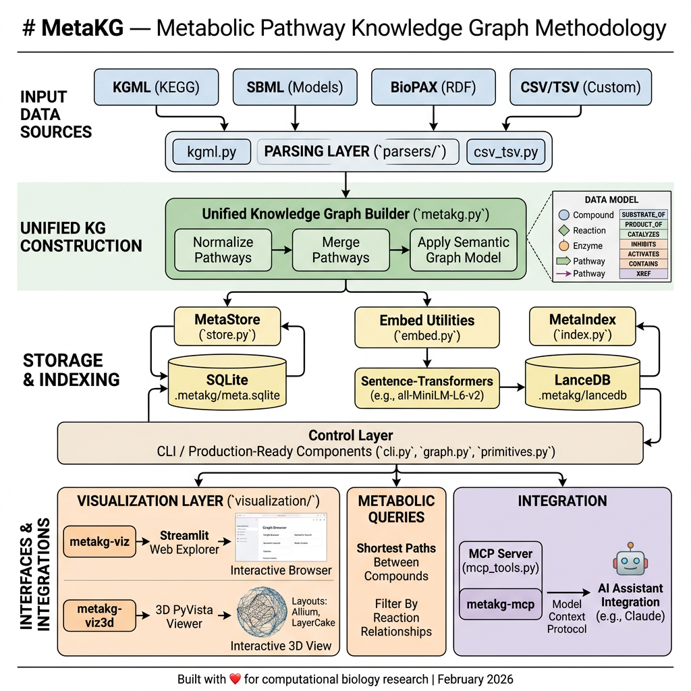

# MetaKG — Metabolic Pathway Knowledge Graph

A comprehensive, extendable knowledge graph system for metabolic pathways with semantic search, interactive visualization, and MCP integration.

**MetaKG** ingests pathway data from multiple formats (KGML, SBML, BioPAX, CSV), builds a unified semantic knowledge graph, and provides powerful querying and visualization tools for exploring metabolic relationships.

**Sister Project:** [CodeKG](https://github.com/flux-frontiers/code_kg) — A codebase knowledge graph system for Python repositories. CodeKG provides the semantic analysis capabilities that make it possible to explore MetaKG's own architecture and implementation.

[](https://www.python.org/downloads/)
[](https://www.elastic.co/licensing/elastic-license)
[](https://github.com/flux-frontiers/meta_kg/releases)
[](https://python-poetry.org/)

## Features

- **Multi-format Parser** — Ingest metabolic pathway data from KGML, SBML, BioPAX, and CSV formats
- **Unified Knowledge Graph** — Normalize and merge pathways into a single semantic graph with compounds, reactions, enzymes, and pathways
- **Semantic Search** — Vector-based similarity search using LanceDB and sentence-transformers
- **Interactive Visualization** — Explore pathways through Streamlit web interface or 3D PyVista viewer
- **Metabolic Queries** — Find shortest paths between compounds, filter by reaction relationships
- **Metabolic Simulations** — Flux balance analysis (FBA), kinetic ODE integration, and what-if perturbation analysis
- **MCP Integration** — Expose the knowledge graph via Model Context Protocol for AI assistant integration
- **Production-Ready** — SQLite persistence, comprehensive error handling, extensive test coverage

## Quick Start

### Installation

```bash
# Clone and navigate to the repository
git clone https://github.com/flux-frontiers/meta_kg.git
cd meta_kg

# Create a Python 3.12 virtual environment
python3.12 -m venv .venv
source .venv/bin/activate

# Install the package with all features
poetry install --extras all
```

### Build the Knowledge Graph

```bash
# Parse pathway files and build the KG
metakg-build --data ./data/pathways --db .metakg/meta.sqlite --lancedb .metakg/lancedb

# Output:
# Building MetaKG from ./data/pathways...
# data_root   : ./data/pathways
# db_path     : .metakg/meta.sqlite
# nodes       : 1234  {'compound': 567, 'reaction': 432, 'enzyme': 156, 'pathway': 79}
# edges       : 5678  {'SUBSTRATE_OF': 2100, 'PRODUCT_OF': 2050, 'CATALYZES': 1234, 'CONTAINS': 294}
# indexed     : 1234 vectors  dim=384
```

### Launch Web Explorer

```bash
metakg-viz --port 8500

# Opens interactive browser at http://localhost:8500
```

### Launch 3D Visualizer

```bash
metakg-viz3d --layout allium

# Opens interactive 3D viewer with metabolic pathway visualization
```

### Start MCP Server

```bash
metakg-mcp --transport stdio

# Exposes knowledge graph to Claude and other AI assistants
```

## Architecture



```
metakg/
├── parsers/              # Format-specific parsers
│   ├── kgml.py          # KEGG KGML parser
│   ├── sbml.py          # SBML format parser
│   ├── biopax.py        # BioPAX format parser
│   └── csv_tsv.py       # CSV/TSV table parser
│
├── graph.py             # MetabolicGraph: file discovery & dispatch
├── primitives.py        # MetaNode, MetaEdge: core data types
├── store.py             # MetaStore: SQLite persistence layer
├── index.py             # MetaIndex: LanceDB vector indexing
├── embed.py             # Embedding utilities
│
├── cli.py               # Command-line entry points
├── mcp_tools.py         # MCP server implementation
│
├── visualization/
│   ├── app.py           # Streamlit web explorer
│   ├── metakg_viz.py    # Streamlit launcher
│   ├── layout3d.py      # 3D layout algorithms (Allium, LayerCake)
│   ├── viz3d.py         # PyVista 3D viewer
│   └── metakg_viz3d.py  # 3D visualizer launcher
│
└── metakg.py            # MetaKG: orchestrator
```

### Data Model

**Nodes** (4 kinds):
- **Compound** — Small molecule metabolites (e.g., glucose, ATP)
- **Reaction** — Biochemical transformations
- **Enzyme** — Proteins that catalyze reactions
- **Pathway** — Organized sets of reactions (e.g., glycolysis)

**Edges** (7 relation types):
- `SUBSTRATE_OF` — Compound is consumed in reaction
- `PRODUCT_OF` — Compound is produced by reaction
- `CATALYZES` — Enzyme catalyzes reaction
- `INHIBITS` — Compound inhibits reaction
- `ACTIVATES` — Compound activates reaction
- `CONTAINS` — Pathway contains reaction/compound
- `XREF` — Cross-reference to external database

## Commands

### `metakg-build`

Parse pathway files and build the knowledge graph.

```bash
metakg-build --data ./pathways \
             --db .metakg/meta.sqlite \
             --lancedb .metakg/lancedb \
             --model all-MiniLM-L6-v2 \
             --wipe

Options:
  --data PATH              Directory containing pathway files (required)
  --db PATH                SQLite database path (default: .metakg/meta.sqlite)
  --lancedb PATH           LanceDB directory (default: .metakg/lancedb)
  --model NAME             Sentence-transformer model (default: all-MiniLM-L6-v2)
  --no-index               Skip building LanceDB vector index
  --wipe                   Wipe existing data before building
```

### `metakg-viz`

Launch interactive Streamlit web explorer.

```bash
metakg-viz --db .metakg/meta.sqlite \
           --lancedb .metakg/lancedb \
           --port 8500

Options:
  --db PATH                SQLite database path
  --lancedb PATH           LanceDB directory path
  --port PORT              Streamlit server port (default: 8500)
  --no-browser             Don't open browser automatically
```

**Features:**
- **Graph Browser** — Visualize full or filtered metabolic network
- **Semantic Search** — Query by description or keywords
- **Node Details** — View comprehensive node information with cross-references

### `metakg-viz3d`

Launch interactive 3D PyVista metabolic pathway visualizer.

```bash
metakg-viz3d --db .metakg/meta.sqlite \
             --layout allium \
             --width 1400 \
             --height 900

Options:
  --db PATH                SQLite database path
  --lancedb PATH           LanceDB directory path
  --layout {allium,cake}   3D layout strategy (default: allium)
  --width INT              Window width in pixels (default: 1400)
  --height INT             Window height in pixels (default: 900)
  --export-html PATH       Export to HTML instead of opening GUI
  --export-png PATH        Export to PNG instead of opening GUI
```

**Layout Strategies:**
- **Allium** — Each pathway rendered as a "Giant Allium flower" with reactions/compounds forming a sphere around it
- **LayerCake** — Vertical stratification by node kind (pathways at bottom, reactions middle, compounds/enzymes at top)

### `metakg-mcp`

Start MCP server to expose the knowledge graph to Claude and other AI assistants.

```bash
metakg-mcp --db .metakg/meta.sqlite \
           --lancedb .metakg/lancedb \
           --transport stdio

Options:
  --db PATH                SQLite database path
  --lancedb PATH           LanceDB directory path
  --transport {stdio,sse}  MCP transport method (default: stdio)
```

## Python API

### Basic Usage

```python
from metakg import MetaKG

# Build the knowledge graph
kg = MetaKG(db_path=".metakg/meta.sqlite", lancedb_dir=".metakg/lancedb")
stats = kg.build(data_dir="./pathways", wipe=True, build_index=True)
print(stats)

# Query a single node
compound = kg.store.node("cpd:kegg:C00022")  # Pyruvate
print(f"Name: {compound['name']}")
print(f"Formula: {compound['formula']}")

# Find neighbors
neighbors = kg.store.neighbours("cpd:kegg:C00022", rels=("SUBSTRATE_OF",))

# Get reaction with full context
rxn = kg.store.reaction_detail("rxn:kegg:R00200")
print(f"Substrates: {rxn['substrates']}")
print(f"Products: {rxn['products']}")
print(f"Enzymes: {rxn['enzymes']}")

# Find shortest metabolic path
path = kg.store.find_shortest_path(
    from_id="cpd:kegg:C00022",  # Pyruvate
    to_id="cpd:kegg:C00084",    # Acetyl-CoA
    max_hops=6
)
print(f"Path: {[n['name'] for n in path['path']]}")
print(f"Hops: {path['hops']}")

kg.close()
```

### Semantic Search

```python
from metakg import MetaKG

kg = MetaKG(db_path=".metakg/meta.sqlite", lancedb_dir=".metakg/lancedb")

# Semantic similarity search
results = kg.query_pathway("glucose metabolism", k=10)
for hit in results.hits:
    print(f"{hit['name']}: {hit['description'][:100]}")

kg.close()
```

### Metabolic Simulations

**Flux Balance Analysis (FBA):**
```python
from metakg import MetaKG

kg = MetaKG(db_path=".metakg/meta.sqlite", lancedb_dir=".metakg/lancedb")

# Run steady-state optimization
result = kg.simulate_fba(
    pathway_id="pwy:kegg:hsa00010",  # Glycolysis
    maximize=True
)
print(f"Status: {result['status']}")
print(f"Objective value: {result['objective_value']}")

kg.close()
```

**Kinetic ODE Simulation:**
```python
# Time-course with Michaelis-Menten kinetics
result = kg.simulate_ode(
    pathway_id="pwy:kegg:hsa00010",
    t_end=20,
    t_points=50,
    initial_concentrations={"cpd:kegg:C00031": 5.0},  # Glucose: 5 mM
    ode_method="BDF",      # Stiff ODE solver (recommended)
    ode_rtol=1e-3,         # Relative tolerance
    ode_atol=1e-5,         # Absolute tolerance
    ode_max_step=None,     # Let solver choose step size
)
print(f"Status: {result['status']}")
print(f"Final concentrations: {result['concentrations']}")
```

**What-If Analysis (Perturbations):**
```python
import json

# Compare baseline vs. enzyme knockout
scenario = {
    "name": "hexokinase_knockout",
    "enzyme_knockouts": ["enz:kegg:hsa:2539"]
}
result = kg.simulate_whatif(
    pathway_id="pwy:kegg:hsa00010",
    scenario_json=json.dumps(scenario),
    mode="fba"
)
baseline = result["baseline"]["objective_value"]
perturbed = result["perturbed"]["objective_value"]
print(f"Change: {100 * (perturbed - baseline) / baseline:+.1f}%")
```

**ODE Solver Notes:**
- Default solver is **BDF** (stiff-optimized) for metabolic systems
- Metabolic ODEs are inherently stiff (fast enzyme kinetics + slow substrate dynamics)
- Use `ode_method="BDF"` (default) for metabolic pathways
- `ode_method="RK45"` (explicit, non-stiff) will hang on stiff systems—do not use
- Set `ode_max_step=None` (default) to let solver adapt; never force small steps on stiff systems

### Visualization in Code

```python
from metakg.store import GraphStore
from metakg.layout3d import AlliumLayout, LayoutNode, LayoutEdge

# Load graph
store = GraphStore(".metakg/meta.sqlite")
nodes_data = store.query_nodes()
edges_data = store.query_edges()

# Convert to layout nodes/edges
layout_nodes = [LayoutNode.from_dict(n) for n in nodes_data]
layout_edges = [LayoutEdge.from_dict(e) for e in edges_data]

# Compute 3D positions
layout = AlliumLayout()
positions = layout.compute(layout_nodes, layout_edges)

# positions is now a dict mapping node_id -> [x, y, z]
for node in layout_nodes[:5]:
    pos = positions[node.id]
    print(f"{node.name}: ({pos[0]:.2f}, {pos[1]:.2f}, {pos[2]:.2f})")

store.close()
```

## Supported Input Formats

### KGML (KEGG Markup Language)
- Native KEGG pathway format
- Requires pathway XML files from KEGG database
- Automatically detects via root element check

### SBML (Systems Biology Markup Language)
- Standard for computational models
- Supports Level 3 Version 1+ formats
- Includes stoichiometry and compartment information

### BioPAX (Biological Pathway Exchange)
- OWL-based RDF format
- Supports pathways from databases like Reactome
- Requires `rdflib` extra: `poetry install --extras biopax`

### CSV/TSV
- Simple tab-separated or comma-separated tables
- Columns: `source_id`, `source_name`, `target_id`, `target_name`, `relationship`, `relationship_type`
- Useful for custom pathway data

## Installation Variants

```bash
# Core functionality only
poetry install

# Web visualization
poetry install --extras viz

# 3D visualization (includes PyVista, PyQt5)
poetry install --extras viz3d

# BioPAX format support
poetry install --extras biopax

# MCP integration
poetry install --extras mcp

# Everything
poetry install --extras all
```

## Configuration

### Environment Variables

```bash
# Visualization
export METAKG_DB=".metakg/meta.sqlite"
export METAKG_LANCEDB=".metakg/lancedb"

# Embedding model
export METAKG_MODEL="all-MiniLM-L6-v2"

# Docker deployment
export METAKG_DB="/data/meta.sqlite"
export METAKG_LANCEDB="/data/lancedb"
```

### Database Defaults

- **SQLite** — `.metakg/meta.sqlite`
- **LanceDB** — `.metakg/lancedb`
- **Embedding Model** — `all-MiniLM-L6-v2` (384-dimensional vectors)

## Performance Characteristics

| Operation | Time | Notes |
|-----------|------|-------|
| Parse 100 KGML files | ~30s | Varies by complexity |
| Build vector index | ~2min | For ~1000 nodes at 384-dim |
| Semantic search | <100ms | LanceDB approximate nearest neighbor |
| Shortest path (6 hops) | <50ms | BFS with ~1000 nodes |
| Full graph load | <500ms | SQLite with indices |

## Testing

```bash
# Run all tests
poetry run pytest

# Run with coverage
poetry run pytest --cov=metakg --cov-report=html

# Run specific test
poetry run pytest tests/test_parsers.py::test_kgml_parser
```

Test coverage includes:
- Parser correctness (KGML, SBML, BioPAX, CSV)
- Data model validation
- Store operations
- Semantic search accuracy
- Graph queries (shortest path, neighbors)

## Contributing

Contributions are welcome! Please follow these guidelines:

1. **Fork and branch** — Create a feature branch from `main`
2. **Follow style** — Use [ruff](https://docs.astral.sh/ruff/) and [mypy](https://mypy.readthedocs.io/) for type checking
3. **Write tests** — Add tests for new features in `tests/`
4. **Document** — Update docstrings using `:param:` style (per project conventions)
5. **Commit clearly** — Use descriptive commit messages
6. **Submit PR** — Include description of changes and rationale

### Code Quality

```bash
# Lint and format
poetry run ruff check --fix src/

# Type checking
poetry run mypy src/metakg/

# Format with ruff
poetry run ruff format src/
```

## Roadmap

- [ ] GPU-accelerated embedding for large datasets
- [ ] GraphQL query API
- [ ] Advanced graph algorithms (centrality, community detection)
- [ ] Drug-gene interaction networks
- [ ] Integration with UniProt and ChEBI APIs
- [ ] Differential pathway analysis
- [ ] Export to Cytoscape format

## Citation

If you use MetaKG in research, please cite:

```bibtex
@software{flux_frontiers2024metakg,
  title={MetaKG: Metabolic Pathway Knowledge Graph},
  author={Flux Frontiers Contributors},
  year={2024},
  url={https://github.com/flux-frontiers/meta_kg}
}
```

## License

MetaKG is licensed under the **PolyForm Noncommercial License 1.0.0**.

This means:
- ✅ Free for **academic research** and **educational** use
- ✅ Free for **personal projects**
- ✅ Free for **evaluation**
- ❌ Not permitted for **commercial use**

For commercial licensing inquiries, please contact the author.

## Support

- **Documentation** — See docstrings and examples above
- **Issues** — Report bugs on [GitHub Issues](https://github.com/flux-frontiers/meta_kg/issues)
- **Discussions** — Ask questions on [GitHub Discussions](https://github.com/flux-frontiers/meta_kg/discussions)

## Acknowledgments

- [CodeKG](https://github.com/flux-frontiers/code_kg) — Provides semantic analysis and knowledge graph capabilities for this codebase
- Layout algorithms adapted from [repo_vis](https://github.com/Suchanek/repo_vis)
- KEGG, Reactome, and MetaCyc teams for pathway data standards
- PyVista, Streamlit, and LanceDB communities for visualization and indexing

---

**Built with ❤️ for computational biology research -egs- **

*Last updated: February 2026*
